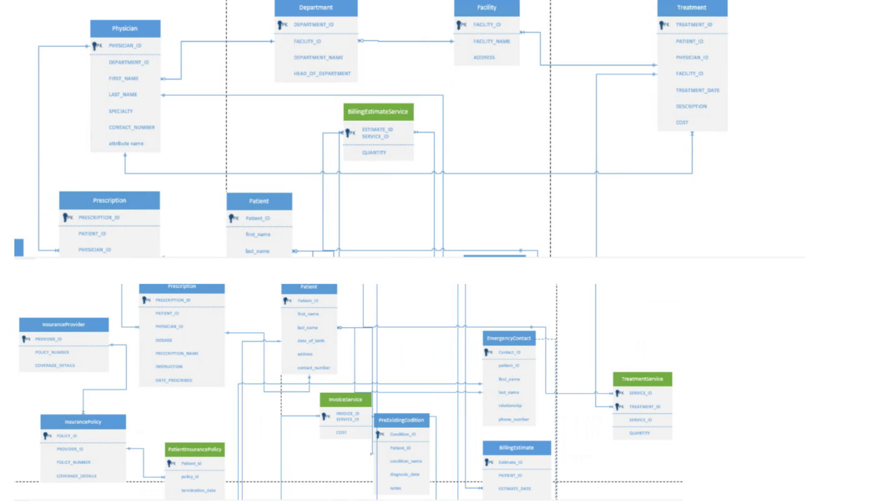
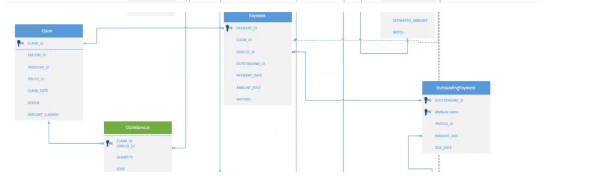

# Healthcare Cost Transparency Database

## Project Overview

This project involved the design and implementation of a relational database system focused on healthcare cost transparency. The database was developed to model how patient, treatment, insurance, billing, claims, and payment information could be organized to provide clearer financial information before and after medical services.

The system was implemented in Microsoft Access and includes relational tables, primary and foreign key relationships, SQL queries, business forms, and reports.

## Business Problem

Healthcare billing can involve multiple services, insurance policies, claims, estimates, invoices, and payments, making it difficult for patients to understand their expected financial responsibility.

The database was designed to support a more centralized approach to healthcare cost information by connecting patient records with services, treatments, insurance coverage, billing estimates, invoices, claims, and payments.

## Project Objectives

- Provide patients with pre-service cost estimates
- Store standardized medical service and procedure costs
- Track treatments and associated services
- Manage insurance policies and claims
- Generate and track patient invoices and payments
- Compare estimated costs with actual billed amounts
- Support financial reporting and cost transparency

## Database Design

The relational database was designed primarily in Third Normal Form (3NF) to reduce redundancy and maintain data integrity.

The design incorporates:

- Primary and foreign keys
- One-to-many relationships
- Many-to-many relationships using junction tables
- Referential integrity
- Derived financial attributes
- Controlled denormalization where historical transaction values needed to be preserved

Key entities include:

- Patient
- Physician
- Department
- Facility
- Service
- Treatment
- Billing Estimate
- Invoice
- Insurance Provider
- Insurance Policy
- Claim
- Payment
- Prescription
- Outstanding Payment

Junction tables were used to model relationships between services and transactions, including treatment services, billing estimate services, invoice services, and claim services.
## Entity Relationship Diagram

The ERD below illustrates the relational structure of the healthcare cost transparency database, including patient care, insurance, billing, claims, and payment data.

### ERD — Part 1

### ERD — Part 2

The database connects patient, physician, treatment, insurance, billing, claims, and payment information through primary and foreign key relationships.

Bridge tables such as `Treatment_Service`, `BillingEstimate_Service`, `Invoice_Service`, and `Claim_Service` are used to resolve many-to-many relationships between healthcare services and related transactions.

## SQL Queries

SQL queries were developed to retrieve and analyze information stored within the database.

Examples include:

### Treatment Costs
Retrieves treatments along with the patient, associated medical services, quantities, service costs, and total treatment costs.

### Invoice Services
Connects patient invoices with the individual services and costs included on each invoice.

### Estimated vs. Actual Cost
Compares pre-service billing estimates with actual invoice amounts to identify differences between expected and billed healthcare costs.

## Forms & Reports

The project also considered user-facing business forms and reporting requirements, including:

- Patient registration
- Insurance claims
- Billing summaries
- Patient visit summaries

These components demonstrate how the underlying relational database could support operational healthcare workflows and financial reporting.

## Technologies & Concepts

- Microsoft Access
- SQL
- Relational Database Design
- Entity Relationship Diagrams (ERD)
- Database Normalization
- Primary & Foreign Keys
- Junction Tables
- Referential Integrity
- Data Dictionaries
- Business Rules
- Database Reporting

## Repository Contents

- **Healthcare_Cost_Transparency_Database.accdb** — Microsoft Access implementation of the relational database
- **Database_Design_and_Documentation.pdf** — Business requirements, business rules, normalized ERD, data dictionary, design decisions, forms, and reports
- **SQL_Queries_and_Reports.pdf** — SQL queries and selected database reports

## Project Contribution

This was a collaborative academic project. My primary role was Database Designer, where I contributed to the design of database tables and relationships, ERD development, and review and editing of database documentation.

## Author

Sedi Kartey  
UNC Charlotte
